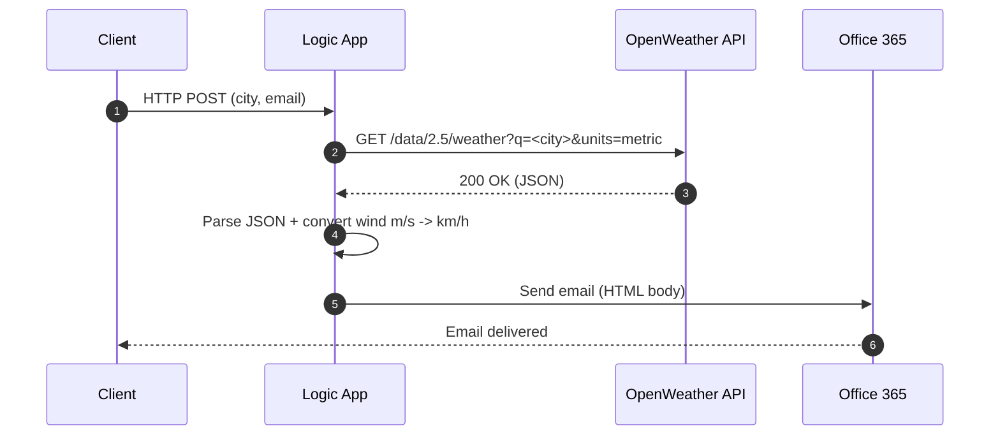

````markdown
# 🌤 Azure Logic Apps - Weather to Email

**Weather Mailer** is a clean, ready-to-deploy **Azure Logic App** that takes a city name and an email address, fetches live weather data from [OpenWeather](https://openweathermap.org/api), and sends a well-formatted email using Office 365.

[](https://portal.azure.com/#create/Microsoft.Template/uri/https%3A%2F%2Fraw.githubusercontent.com%2FOfekBenEliezer%2Fcaptain-azure-logicapps-weather-mailer%2Fmain%2Fdeploy%2Fazuredeploy.json)

---

## 🚀 What it does
1. **HTTP trigger** receives a JSON payload:
   ```json
   { "city": "Tel Aviv", "email": "user@example.com" }
````

2. **Calls OpenWeather API** in metric units (°C).
3. **Parses and processes** temperature, feels\_like, humidity, wind speed, and description.
4. **Converts wind speed** from m/s to km/h.
5. **Sends a formatted email** via Office 365.

---


```markdown
## 🧭 Architecture
```mermaid
flowchart LR
  A[Client or Caller] -->|HTTP POST JSON (city, email)| B[Logic App - HTTP Trigger]
  B --> C[HTTP action - OpenWeather API]
  C -->|JSON weather data| D[Parse JSON]
  D --> E[Compose values: temp, feels_like, humidity, wind m/s -> km/h]
  E --> F[Office 365 - Send an email]
  F --> G[Recipient inbox]


  classDef azure fill:#2563eb,stroke:#1e40af,stroke-width:1,color:#fff
  classDef svc fill:#0ea5e9,stroke:#0369a1,stroke-width:1,color:#fff
  class B,D,E azure
  class C,F svc
```

```markdown
## Sequence


---

## 🗂 Repository structure

```
deploy/
 ├─ azuredeploy.json             # ARM template - Logic App + Office 365 connection + $connections
 ├─ azuredeploy.parameters.json  # Sample parameters file
workflow/
 └─ logicapp.definition.json     # Full Logic App workflow definition (WDL)
docs/
 └─ screenshots / diagrams       # Optional assets
```

---

## 📦 Deploy to Azure

Use the button at the top or the Azure CLI:

```powershell
$definition = Get-Content -Raw workflow/logicapp.definition.json
az login
az account set --subscription "<YOUR_SUBSCRIPTION_ID>"
az group create -n rg-logicapps-demo -l westeurope
az deployment group create `
  -g rg-logicapps-demo `
  -f deploy/azuredeploy.json `
  -p logicAppName="la-weather-mailer" `
     location="westeurope" `
     openWeatherKey="<YOUR_OPENWEATHER_KEY>" `
     office365ConnectionName="office365" `
     workflowDefinition="$definition"
```

---

## ⚙ Prerequisites

* Active Azure subscription with permissions to deploy resources
* OpenWeather API key
* Office 365 account with permissions to send email

---

## 🛠 How to use after deployment

1. Open your Logic App in Azure Portal.
2. Go to the HTTP trigger and copy the **HTTP POST URL**.
3. Send a POST request with the following JSON:

   ```json
   {
     "city": "London",
     "email": "you@example.com"
   }
   ```
4. Check your inbox for the formatted weather email.

Optional curl example:

```bash
curl -X POST "<HTTP_POST_URL>" \
  -H "Content-Type: application/json" \
  -d '{ "city": "London", "email": "you@example.com" }'
```

---

## 📌 Example email output

| Parameter   | Example value |
| ----------- | ------------- |
| City        | Tel Aviv      |
| Temperature | 28°C          |
| Feels Like  | 30°C          |
| Humidity    | 60%           |
| Wind Speed  | 14 km/h       |
| Description | Clear sky     |

---

## 🧰 Troubleshooting

* **401 on trigger** - verify you used the full HTTP POST URL including the `sig` query string.
* **400 bad request** - make sure both `city` and `email` are present and valid.
* **Email not sent** - ensure the Office 365 connection is authorized and has permissions to send mail.

---

## 🔐 Security notes

* Do not commit secrets. Provide the OpenWeather key via parameters or Key Vault.
* Protect the HTTP trigger with SAS or Azure AD when used in production.
* Add retry policies and error scopes for resilience.
* Monitor runs with Azure Monitor or Log Analytics.

---

## ✨ Credits

Built by **Captain Azure - Ofek Ben Eliezer**
Microsoft Certified Trainer | Azure Architect | AI & Cloud Expert

```
::contentReference[oaicite:0]{index=0}
```
