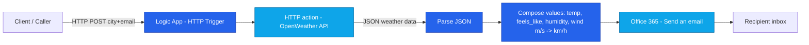
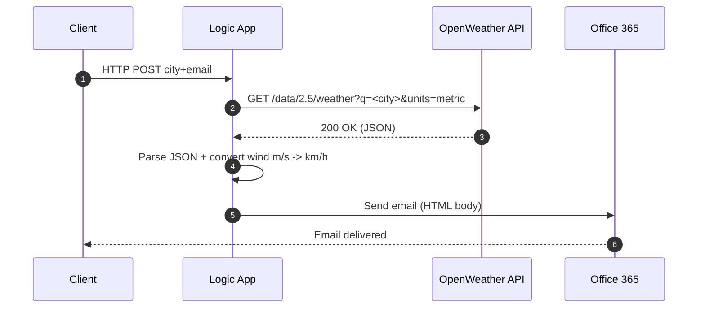

# 🌤 Azure Logic Apps - Weather to Email

**Weather Mailer** is a clean, ready-to-deploy **Azure Logic App** that takes a city name and an email address, fetches live weather data from [OpenWeather](https://openweathermap.org/api), and sends a well-formatted email using Office 365.

[](https://portal.azure.com/#create/Microsoft.Template/uri/https%3A%2F%2Fraw.githubusercontent.com%2FOfekBenEliezer%2Fcaptain-azure-logicapps-weather-mailer%2Fmain%2Fdeploy%2Fazuredeploy.json)

---

## 🚀 What it does

1. **HTTP trigger** receives a JSON payload:

   ```json
   { "city": "Tel Aviv", "email": "user@example.com" }
   ```
2. **Calls OpenWeather API** in metric units (°C).
3. **Parses and processes** temperature, feels\_like, humidity, wind speed, and description.
4. **Converts wind speed** from m/s to km/h.
5. **Sends a formatted email** via Office 365.

---

## 🧭 Architecture



## Sequence



---

## 🗂 Repository Structure

```
deploy/
 ├─ azuredeploy.json             # ARM template for Logic App + O365 connection + $connections
 ├─ azuredeploy.parameters.json  # Example parameter file
workflow/
 └─ logicapp.definition.json     # Full Logic App workflow definition (WDL)
docs/
 └─ screenshots / diagrams       # Optional
```

---

## 📦 Deploy to Azure

Use the button at the top or the Azure CLI:

```powershell
$definition = Get-Content -Raw workflow/logicapp.definition.json
az login
az account set --subscription "<YOUR_SUBSCRIPTION_ID>"
az group create -n rg-logicapps-demo -l westeurope
az deployment group create `
  -g rg-logicapps-demo `
  -f deploy/azuredeploy.json `
  -p logicAppName="la-weather-mailer" `
     location="westeurope" `
     openWeatherKey="<YOUR_OPENWEATHER_KEY>" `
     office365ConnectionName="office365" `
     workflowDefinition="$definition"
```

---

## ⚙ Prerequisites

* Active Azure subscription with permissions to deploy resources
* OpenWeather API key
* Office 365 account with permission to send email

---

## 🛠 How to use after deployment

1. Open your Logic App in Azure Portal.
2. Copy the **HTTP POST URL** from the HTTP trigger.
3. Send a POST request with:

   ```json
   { "city": "London", "email": "you@example.com" }
   ```
4. Check your inbox for the formatted weather email.

---

## 📌 Example Email Output

| Parameter   | Example Value |
| ----------- | ------------- |
| City        | Tel Aviv      |
| Temperature | 28°C          |
| Feels Like  | 30°C          |
| Humidity    | 60%           |
| Wind Speed  | 14 km/h       |
| Description | Clear sky     |

---

## ✨ Credits

Developed by **[Captain Azure - Ofek Ben Eliezer](https://github.com/OfekBenEliezer)**
Microsoft Certified Trainer | Azure Architect | AI & Cloud Expert

---

אם עדיין לא מוצג, וודא שאין בטעות \`\`\` בתחילת הקובץ או בסופו שמקיפים את כל ה-README.
